

  

<h1 align="center">School Management System</h1>

  A role-based School Management System built with Laravel

---

## 🚀 Features

### 🌐 Public
- Home page with course listing
- Course details page
- Live course search (AJAX)
- Student & Admin login
- Student registration

### 🛠️ Admin Panel
- Student management (CRUD)
- Course management (CRUD)
- Lecture management by course
- Notice management
- Assign courses to students
- Update payment status
- AJAX-based student details & course views

### 🎓 Student Panel
- Student dashboard
- Profile view & update
- View enrolled courses
- View notices published by admin

---

## 📸 Screenshots

<table align="center" width="100%">
  <tr>
    <td align="center" width="50%">
      <strong>Home Page</strong> 
      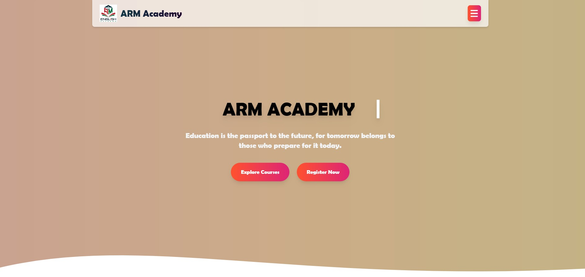
    </td>
    <td align="center" width="50%">
      <strong>Home Page</strong> 
      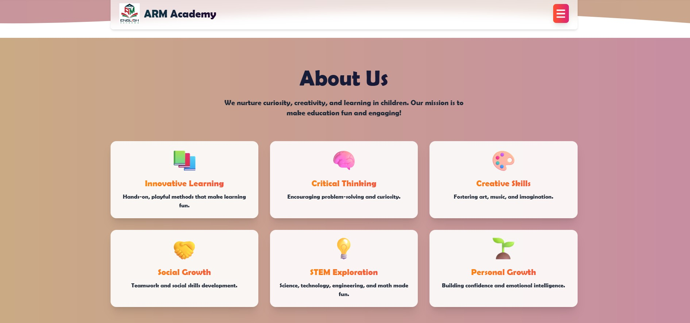
    </td>
  </tr>

  <tr>
    <td align="center">
      <strong>Home Page</strong> 
      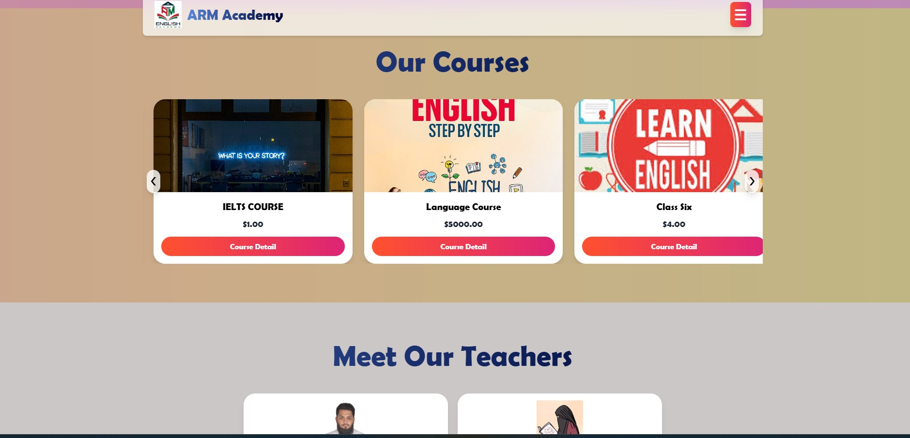
    </td>
    <td align="center">
      <strong>Home Page</strong> 
      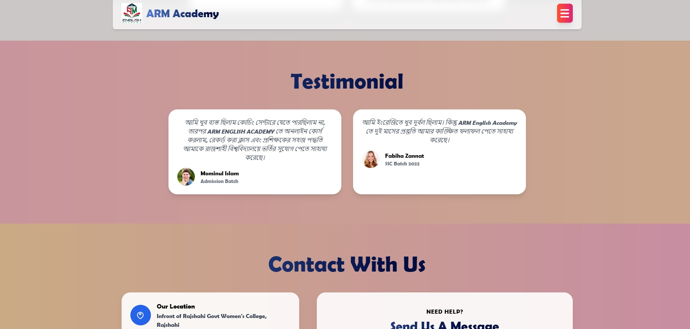
    </td>
  </tr>

  <tr>
    <td align="center">
      <strong>Home Page</strong> 
      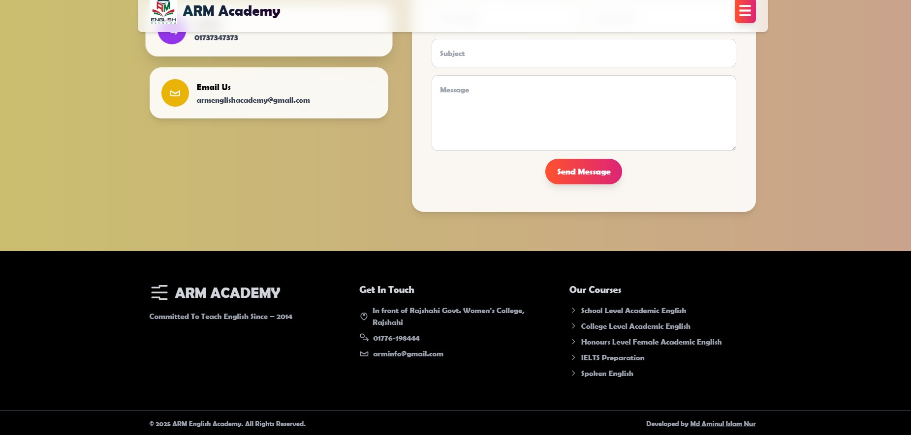
    </td>
    <td align="center">
      <strong>Register Page</strong> 
      
    </td>
  </tr>

  <tr>
    <td align="center">
      <strong>Login Page</strong> 
      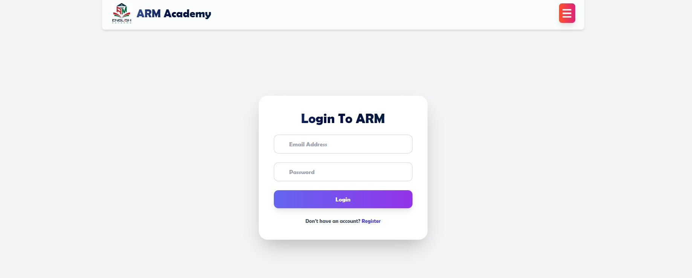
    </td>
    <td align="center">
      <strong>Admin Dashboard</strong> 
      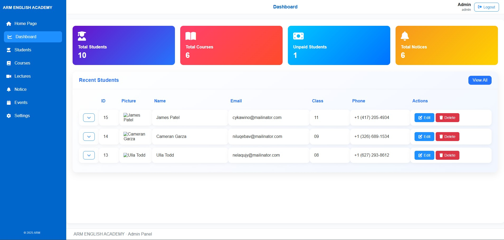
    </td>
  </tr>

  <tr>
    <td align="center">
      <strong>Student Details</strong> 
      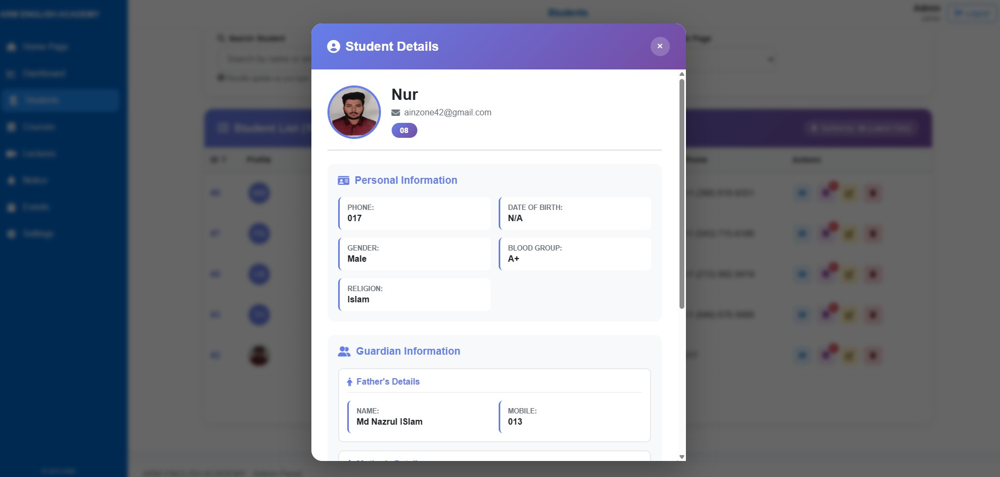
    </td>
    <td align="center">
      <strong>Student Dashboard</strong> 
      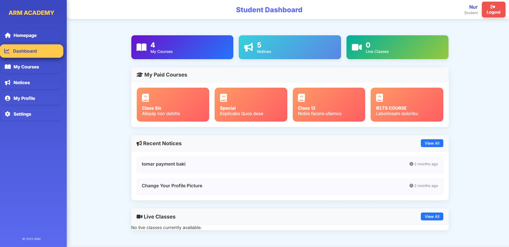
    </td>
  </tr>

  <tr>
    <td align="center">
      <strong>Student Course Access</strong> 
      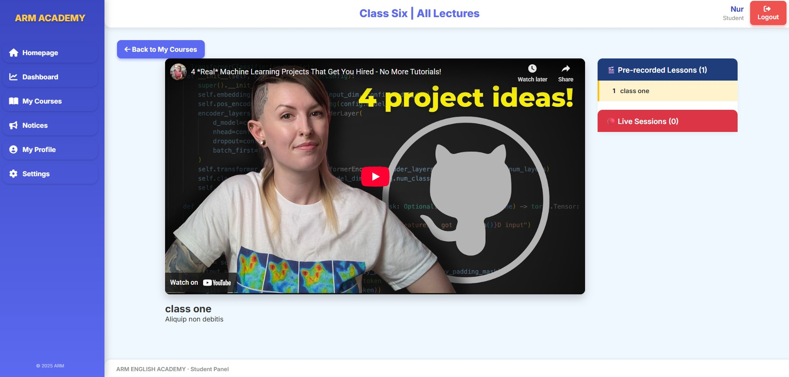
    </td>
    <td align="center">
      <strong>Student Notices</strong> 
      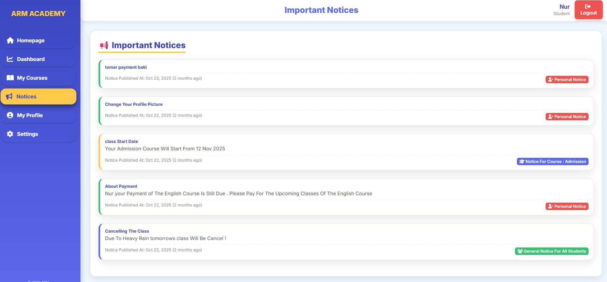
    </td>
  </tr>

  <tr>
    <td align="center">
      <strong>Student Profile</strong> 
      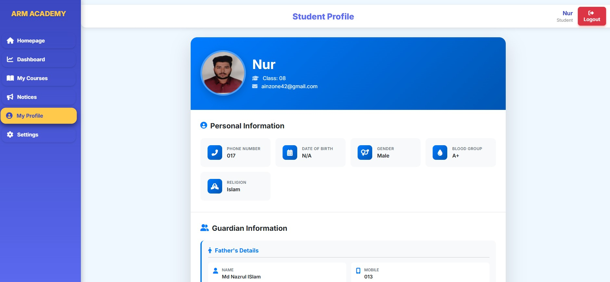
    </td>
    <td align="center">
      <!-- empty cell for balance -->
    </td>
  </tr>
</table>

